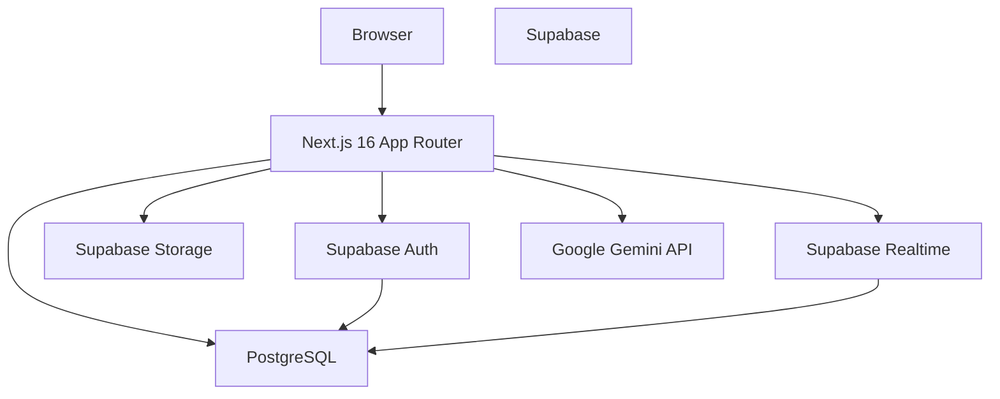

# Xchange

A peer-to-peer marketplace for digital products with real-time communication and AI-assisted listing creation.

Xchange lets users discover, list, and exchange digital goods — subscriptions, templates, coupon codes, art, and more. Built with Next.js 16, Supabase, and Google Gemini for intelligent categorization and description generation.


---

## What Xchange Does

Users create listings with images, set prices, and categorize items as either "selling" or "requesting." The marketplace supports real-time chat between buyers and sellers, with typing indicators and read receipts. AI automatically categorizes posts and generates descriptions from uploaded images.

**Who it's for:** Anyone buying or selling digital products — streaming subscriptions, design templates, discount codes, digital art, or other virtual goods.

**What makes it different:** Real-time messaging built directly into the marketplace, AI-assisted listing creation, and a clean mobile-first interface.

---

## Features

### Marketplace Listings

Create posts with images, titles, descriptions, prices, and tags. Toggle between "selling" and "requesting" modes. Listings are publicly visible and sorted chronologically.

### Real-Time Chat

Instant messaging between buyers and sellers. Chat threads subscribe to Supabase Realtime updates so new messages appear without polling. Typing indicators show when the other participant is composing a message.

### AI-Powered Categorization

Google Gemini analyzes post titles, descriptions, and images to automatically classify items into categories: Subscription, Templates, Coupon Code, Art, or Others. Falls back to keyword-based classification if the API is unavailable.

### AI Description Generation

Upload an image and let Gemini generate a compelling product description. Supports both selling and requesting modes with context-aware prompts. Falls back to keyword-based templates if AI fails.

### Authentication & Profiles

Supabase Auth handles email/password signup and signin. User profiles include avatars, usernames, bios, and portfolio links. Account deletion cascades to all user data for privacy.

### Saved Posts

Bookmark posts for later viewing. Saved posts are private to each user and persist across sessions.

### User Blocking

Block other users to prevent unwanted interactions. Blocked users' messages are filtered from realtime subscriptions.

### Soft-Delete Chats

Chats support soft deletion — when a user deletes a conversation, it's only hidden for them. The other participant can still access the thread.

---

## Technical Highlights

**Next.js 16 App Router** — Server-side rendering with React Server Components and streaming. Auth refresh handled via Next.js proxy pattern (`src/proxy.ts`) to avoid build-time client initialization errors.

**Supabase SSR** — Separate browser and server clients using `@supabase/ssr`. Server client uses async cookies for session management in server components.

**Realtime Messaging** — Chat threads subscribe to PostgreSQL logical replication via Supabase Realtime. Message INSERT/UPDATE events trigger instant UI updates. Presence channels handle typing indicators.

**Row Level Security** — All database tables have RLS policies. Users can only read/write their own data, with public read access for posts and profiles. Chat participants can access their shared conversations.

**AI Fallback Strategy** — Gemini API calls attempt multiple models (`gemini-2.0-flash`, `gemini-2.5-flash`, `gemini-pro`) in sequence. If all fail or the API key is missing, keyword-based logic provides graceful degradation.

**Read Receipts via SECURITY DEFINER** — A PostgreSQL function with elevated privileges allows chat participants to mark messages from others as read while preventing modification of message content.

**Cascade Deletion** — Foreign key constraints with `ON DELETE CASCADE` ensure data consistency. Deleting a user removes their posts, chats, messages, and saved posts. Deleting a post removes associated chats and messages.

**Optimistic UI** — Chat messages update local state immediately on send, with realtime subscriptions handling server confirmation. Typing indicators sync via presence state.

---

## Architecture



**Frontend:** Next.js 16 with React Server Components. Client-side state managed via React hooks. Tailwind CSS for styling, Framer Motion and GSAP for animations.

**Backend:** Supabase provides Auth, PostgreSQL database, object storage, and realtime subscriptions. No custom backend server — all database operations go through Supabase client libraries.

**AI:** Google Gemini API called from Next.js API routes (`/api/autoCategorize`, `/api/generateDescription`). Multimodal models analyze images and text together.

**Storage:** Three public buckets — `post-images` for listings, `avatars` for profile photos, `chat-media` for chat attachments. 5MB upload limit enforced via Zod validation.

---

## Database Schema

**Users** → **Posts** → **Chats** → **Messages**

Users create posts. Posts can have associated chats between the seller and interested buyers. Chats contain messages exchanged between participants.

**Key Relationships:**

- `users.id` references `auth.users` (Supabase Auth)
- `posts.user_id` → `users.id` (CASCADE delete)
- `chats.user1_id`, `chats.user2_id` → `users.id` (CASCADE delete)
- `chats.post_id` → `posts.id` (CASCADE delete)
- `messages.chat_id` → `chats.id` (CASCADE delete)
- `messages.sender_id` → `users.id` (CASCADE delete)
- `saved_posts.user_id` → `users.id`, `saved_posts.post_id` → `posts.id` (CASCADE delete)

**Additional Tables:**

- `saved_posts` — User bookmarks with unique constraint on (user_id, post_id)
- `feedback` — User ratings (1-5) with optional message
- `blocked_users` — User blocking with unique constraint on (blocker_id, blocked_id)

**Security Model:**

RLS policies restrict access based on `auth.uid()`. Public read access for posts and user profiles. Write access limited to own data. Chat participants can read their shared conversations. The `mark_messages_read` function uses SECURITY DEFINER to bypass RLS for read receipts while validating participation.

---

## AI Implementation

**Provider:** Google Gemini API

**Features:**

1. **Auto-categorization** (`/api/autoCategorize`) — Accepts title, description, and optional image URL. Returns category from: Subscription, Templates, Coupon Code, Art, Others. Multimodal analysis when image is provided.

2. **Description generation** (`/api/generateDescription`) — Accepts title, image URL, and mode (selling/requesting). Returns AI-generated description. Mode-aware prompts tailor output for buyers vs sellers.

**Fallback Behavior:**

- Missing API key → keyword-based classification, error message for descriptions
- API failure → keyword-based classification, error message for descriptions
- Model unavailability → tries next model in sequence, then falls back to keywords

**Data Sent:** Post title, description, and image URL. Images are fetched and base64-encoded before sending to Gemini. No user PII or chat content sent to AI.

---

## Realtime System

**What's Realtime:** Message delivery, typing indicators, chat list updates (unread counts, last message, soft deletions).

**Message Delivery:** Chat threads subscribe to `postgres_changes` events on the `messages` table. INSERT events trigger local state updates. UPDATE events handle read receipts.

**Typing Indicators:** Presence channels (`presence-typing-{chatId}`) sync typing state between participants. Each user tracks their own typing status via `channel.track()`.

**Unread State:** Chat table stores `unread_user1` and `unread_user2` counters. Incremented on message send, reset via `mark_messages_read` function when recipient opens chat.

**Subscription Management:** `useChatMessages` hook manages message subscriptions. `subscribeToChatUpdates` handles chat list updates. Subscriptions cleaned up on unmount to prevent memory leaks.

**Blocking Integration:** Realtime message subscriptions check if sender is blocked before delivering messages to local state.

---

## Security

**Authentication:** Supabase Auth with email/password. Session management via `@supabase/ssr` with separate browser and server clients. Auth refresh proxy (`src/proxy.ts`) handles token renewal.

**Row Level Security:** All tables have RLS enabled. Policies restrict access based on `auth.uid()`. Public read for posts/profiles, private write for own data.

**UUID Identifiers:** All user references use UUIDs from Supabase Auth, not usernames. Prevents enumeration attacks.

**Input Validation:** Zod schemas validate all form inputs (signup, signin, posts, profiles, messages). File uploads limited to 5MB and image types only.

**Storage Policies:** Storage buckets have RLS policies. Public read access for images, authenticated write for own uploads.

**Service Role:** Application uses anon and authenticated roles only. No service-role credentials exposed to client.

**SQL Injection:** All database queries use Supabase client parameterized queries. No raw SQL concatenation.

**Read Receipt Security:** `mark_messages_read` function uses SECURITY DEFINER with explicit participant verification. Only allows updating `is_read` and `read_at` fields — message content cannot be modified.

---

## Tech Stack

### Frontend
- Next.js 16.0.1 (App Router)
- React 19.2.0
- TypeScript 5
- Tailwind CSS 4
- Framer Motion 12.23.24
- GSAP 3.13.0
- Lucide React 0.552.0
- React Hook Form 7.66.0
- react-hot-toast 2.6.0

### Backend
- Supabase (Auth, PostgreSQL, Storage, Realtime)
- @supabase/ssr 0.12.5
- @supabase/supabase-js 2.78.0

### AI
- @google/generative-ai 0.24.1 (Google Gemini API)

### Tooling
- ESLint 9
- Zod 4.1.12
- bcryptjs 3.0.3

---

## Project Structure

```text
src/
├── app/                    # Next.js App Router
│   ├── (public)/          # Public routes (signin, signup, welcome)
│   ├── api/               # API routes (AI categorization, description)
│   ├── chat/[id]/         # Chat thread page
│   ├── chats/             # Chat list page
│   ├── feed/              # Main marketplace feed
│   ├── post/              # Post pages (new, [id])
│   ├── profile/           # User profile page
│   ├── layout.tsx         # Root layout
│   └── proxy.ts           # Auth refresh proxy
├── components/            # React components
│   ├── ChatList.tsx       # Chat list with realtime updates
│   ├── ChatThread.tsx     # Chat thread with messages
│   ├── PostMenu.tsx       # Post actions (edit, delete, save)
│   └── ...
├── hooks/                 # Custom React hooks
│   ├── useChatMessages.ts # Chat message subscription
│   ├── useScrollHide.ts   # Scroll-based UI hiding
│   └── useUser.ts         # User auth state
├── lib/                   # Utilities
│   ├── supabase/          # Supabase client initialization
│   ├── db.ts              # Database operations
│   ├── realtime.ts        # Realtime subscriptions
│   ├── validators.ts      # Zod schemas
│   └── ...
└── types/                 # TypeScript type definitions

supabase/
└── migrations/            # Database schema migrations
```

---

## Local Development

### Prerequisites

- Node.js 20+
- npm
- Supabase account

### Installation

```bash
git clone https://github.com/roonakyadav/xchange-it.git
cd xchange-it
npm install
```

### Environment Variables

Create `.env.local`:

```env
NEXT_PUBLIC_SUPABASE_URL=https://your-project.supabase.co
NEXT_PUBLIC_SUPABASE_PUBLISHABLE_KEY=your-publishable-key
GEMINI_API_KEY=your-gemini-api-key
```

### Database Setup

1. Create a Supabase project
2. Run migrations in order from `supabase/migrations/`:
   - `20240101000000_supabase_auth_setup.sql`
   - `20240101000001_core_tables.sql`
   - `20240101000002_additional_tables.sql`
   - `20240101000003_indexes_triggers.sql`
   - `20240101000004_storage_buckets.sql`
   - `20240101000005_realtime_config.sql`
   - `20240101000006_grants.sql`
   - `20240101000007_read_receipt_fix.sql`
3. Create storage buckets: `post-images`, `avatars`, `chat-media`
4. Enable Realtime for messages and chats tables

### Development

```bash
npm run dev
```

Open [http://localhost:3000](http://localhost:3000)

### Build

```bash
npm run build
npm run start
```

### Lint

```bash
npm run lint
```

---

## Environment Variables

| Variable                               | Purpose              | Required |
| -------------------------------------- | -------------------- | -------- |
| `NEXT_PUBLIC_SUPABASE_URL`             | Supabase project URL | Yes      |
| `NEXT_PUBLIC_SUPABASE_PUBLISHABLE_KEY` | Supabase client key  | Yes      |
| `GEMINI_API_KEY`                       | Gemini API access    | No*      |

*Optional — AI features fall back to keyword-based logic if missing.

---

## Known Limitations

- **No automated tests** — Test coverage is currently limited.
- **AI dependency** — Categorization and description quality depend on Gemini API availability.
- **Mobile-only navigation** — Desktop navigation exists but UI is mobile-first.
- **No payment processing** — Marketplace facilitates connections but not transactions.
- **Single-region deployment** — Supabase project region affects latency for global users.
- **No message encryption** — Chat messages stored in plain text in PostgreSQL.

---

## Roadmap

**Completed**
- Real-time chat with typing indicators
- AI-powered categorization and description generation
- User profiles with avatar uploads
- Saved posts and user blocking
- Read receipts via SECURITY DEFINER function

**Planned**
- Message search and filtering
- In-app notifications
- Multi-image support for posts
- Video chat integration
- Escrow-style payment system

---

## Development Notes

**Auth Session Architecture** — Supabase clients are lazy-initialized to avoid build-time errors. Server client uses async cookies from Next.js headers. Auth refresh proxy (`src/proxy.ts`) handles token renewal without exposing service role keys.

**Realtime Subscription Lifecycle** — Subscriptions created in `useEffect` with cleanup functions. Channel references stored in `useRef` to prevent duplicate subscriptions. Status tracking (`SUBSCRIBED`, `CLOSED`) for debugging.

**Image Upload Flow** — Files validated via Zod (5MB limit, image types only). Uploaded to Supabase Storage via `supabase.storage.from().upload()`. Public URL returned and stored in database. Cascade deletion removes files when posts/users deleted.

**AI Fallback Logic** — API routes try multiple Gemini models in sequence. If all fail or API key missing, keyword-based classification uses regex patterns on title/description. Description generation returns error message if AI unavailable.

**RLS Decisions** — Public read for posts/profiles enables marketplace discovery. Private write for own data prevents unauthorized modifications. Chat participants can access shared conversations via subquery in RLS policy.

**Validation Architecture** — Zod schemas define all input shapes. Server-side validation in API routes. Client-side validation in forms with React Hook Form resolvers. Consistent error messages across layers.

---

## Contributing

Contributions are welcome. Please ensure all tests pass and follow the existing code style.

---

## License

This project is not currently licensed. Contact the author for usage permissions.

---

## Author

[roonakyadav](https://github.com/roonakyadav)
