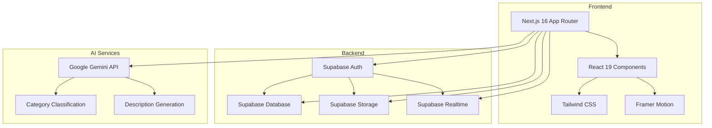

# Xchange

A digital marketplace application with real-time chat, AI-powered categorization, and Supabase backend.

## Overview

Xchange is a marketplace for buying and selling digital goods (subscriptions, templates, coupons, art, etc.). Users can create posts with images, chat in real-time, and manage their profiles. The application uses Supabase for authentication, database, storage, and realtime features.

## Core Features

- **Marketplace**: Create posts with images, categorize items, set prices
- **Real-time Chat**: Instant messaging between buyers and sellers with typing indicators
- **AI Integration**: Google Gemini for automatic post categorization and description generation
- **Authentication**: Supabase Auth with email/password signup and signin
- **Profile Management**: User profiles with avatars, post history, and account deletion
- **Saved Posts**: Bookmark posts for later viewing
- **User Blocking**: Block other users to prevent unwanted interactions
- **Feedback System**: Submit feedback about the application

## Architecture



## Tech Stack

- **Frontend**: Next.js 16 (App Router), React 19, TypeScript
- **Styling**: Tailwind CSS 4
- **Animations**: Framer Motion, GSAP
- **Backend**: Supabase (Auth, PostgreSQL, Storage, Realtime)
- **AI**: Google Gemini API
- **Forms**: React Hook Form + Zod validation
- **Icons**: Lucide React
- **Toasts**: react-hot-toast

## Authentication Architecture

Xchange uses Supabase Auth with SSR support via `@supabase/ssr`:

- **Browser Client**: `createBrowserClient()` for client components
- **Server Client**: `createServerClient()` with async cookies for server components
- **Auth Refresh Proxy**: Next.js 16 proxy pattern (`src/proxy.ts`) for session refresh
- **Lazy Initialization**: Supabase clients are instantiated within functions/hooks to avoid build-time errors

## Database Model

### Tables

**users** - User profiles linked to Supabase Auth
- `id` (UUID, primary key, references auth.users)
- `username` (TEXT, unique)
- `name` (TEXT)
- `avatar_url` (TEXT)
- `bio` (TEXT)
- `portfolio` (TEXT)

**posts** - Marketplace listings
- `id` (UUID, primary key)
- `user_id` (UUID, references users.id)
- `title` (TEXT)
- `description` (TEXT)
- `image_url` (TEXT)
- `mode` (TEXT: 'selling' | 'requesting')
- `price` (NUMERIC)
- `category` (TEXT)
- `tags` (TEXT[])
- `created_at` (TIMESTAMPTZ)

**chats** - Conversation threads
- `id` (UUID, primary key)
- `user1_id` (UUID, references users.id)
- `user2_id` (UUID, references users.id)
- `post_id` (UUID, references posts.id)
- `unread_user1` (INTEGER)
- `unread_user2` (INTEGER)
- `deleted_by_user1` (BOOLEAN)
- `deleted_by_user2` (BOOLEAN)
- `last_message` (TEXT)
- `last_sender_id` (UUID)
- `updated_at` (TIMESTAMPTZ)

**messages** - Chat messages
- `id` (UUID, primary key)
- `chat_id` (UUID, references chats.id)
- `sender_id` (UUID, references users.id)
- `body` (TEXT)
- `type` (TEXT: 'text' | 'media')
- `is_read` (BOOLEAN)
- `read_at` (TIMESTAMPTZ)
- `created_at` (TIMESTAMPTZ)

**saved_posts** - User bookmarks
- `id` (UUID, primary key)
- `user_id` (UUID, references users.id)
- `post_id` (UUID, references posts.id)
- `created_at` (TIMESTAMPTZ)

**feedback** - User feedback
- `id` (UUID, primary key)
- `user_id` (UUID, references users.id)
- `rating` (INTEGER, 1-5)
- `message` (TEXT)
- `created_at` (TIMESTAMPTZ)

**blocked_users** - User blocking
- `id` (UUID, primary key)
- `blocker_id` (UUID, references users.id)
- `blocked_id` (UUID, references users.id)
- `created_at` (TIMESTAMPTZ)

## RLS Security Model

Row Level Security (RLS) is enabled on all tables:

- **users**: Public read, users can update/delete own profile
- **posts**: Public read, authenticated users can CRUD own posts
- **chats**: Participants can read/update own chats (soft delete via UPDATE)
- **messages**: Participants can read/insert/update messages in their chats
- **saved_posts**: Users can CRUD own saved posts
- **feedback**: Users can read/insert own feedback
- **blocked_users**: Users can CRUD own blocks

**Note**: The `messages` UPDATE policy currently only allows senders to update their own messages. This blocks read receipts (marking messages from other users as read). A separate migration is needed to fix this.

## Realtime Architecture

- **Supabase Realtime**: PostgreSQL logical replication for real-time updates
- **Subscriptions**: 
  - Message inserts/updates in chat threads
  - Typing indicators via presence channels
  - Chat updates (unread counters, deletions)
- **Presence**: Typing state shared between participants
- **Auto-mark Read**: Messages auto-marked as read when recipient opens chat

## AI Integration

**Google Gemini API** is used for:

1. **Category Classification** (`/api/autoCategorize`):
   - Analyzes post title, description, and image
   - Classifies into: Subscription, Templates, Coupon Code, Art, Others
   - Falls back to keyword-based classification if API fails

2. **Description Generation** (`/api/generateDescription`):
   - Generates compelling product descriptions from images
   - Supports both "selling" and "requesting" modes
   - Falls back to keyword-based templates if API fails

## Storage Buckets

- **post-images**: Public bucket for post photos
- **avatars**: Public bucket for user avatars
- **chat-media**: Public bucket for chat media uploads

## Local Setup

### Prerequisites

- Node.js 18+
- npm
- Supabase account

### Installation

1. Clone the repository:
```bash
git clone <repository-url>
cd xchange-it
```

2. Install dependencies:
```bash
npm install
```

3. Configure environment variables in `.env.local`:
```env
NEXT_PUBLIC_SUPABASE_URL=https://your-project.supabase.co
NEXT_PUBLIC_SUPABASE_PUBLISHABLE_KEY=your-publishable-key
GEMINI_API_KEY=your-gemini-api-key
```

4. Run database migrations:
```bash
supabase db push
```

5. Start development server:
```bash
npm run dev
```

6. Open [http://localhost:3000](http://localhost:3000)

### Supabase Setup

1. Create a new Supabase project
2. Run the migrations in `supabase/migrations/` in order:
   - `20240101000000_supabase_auth_setup.sql`
   - `20240101000001_core_tables.sql`
   - `20240101000002_additional_tables.sql`
   - `20240101000003_indexes_triggers.sql`
   - `20240101000004_storage_setup.sql`
   - `20240101000005_rls_policies.sql`
   - `20240101000006_grants.sql`
3. Create storage buckets: `post-images`, `avatars`, `chat-media`
4. Configure storage policies (see migration files)

## Development Commands

```bash
npm run dev          # Start development server
npm run build        # Build for production
npm run start        # Start production server
npm run lint         # Run ESLint
```

## Known Limitations

1. **Read Receipts**: The `messages` UPDATE policy blocks marking messages from other users as read. This needs a separate RLS policy fix.
2. **No Tests**: The project currently has no automated tests.
3. **Username-Based References**: Some legacy code may still reference users by username instead of UUID (mostly fixed).
4. **AI API Key**: Gemini API key is required for AI features; fallback to keyword-based classification if missing.
5. **Service Role**: No service-role credentials are used; all operations use anon/authenticated roles.

## Project Structure

```
src/
├── app/                    # Next.js App Router
│   ├── (public)/          # Public routes
│   │   ├── signin/        # Login
│   │   ├── signup/        # Registration
│   │   └── welcome/       # Welcome animation
│   ├── api/               # API routes
│   │   ├── autoCategorize/ # AI categorization
│   │   └── generateDescription/ # AI description generation
│   ├── chat/[id]/         # Chat thread
│   ├── chats/             # Chat list
│   ├── feed/              # Main feed
│   ├── post/              # Post pages
│   │   ├── new/           # Create post
│   │   └── [id]/          # Post details
│   ├── profile/           # User profile
│   ├── layout.tsx         # Root layout
│   └── proxy.ts           # Auth refresh proxy
├── components/            # React components
│   ├── AppClient.tsx      # Client wrapper
│   ├── BottomNav.tsx      # Mobile navigation
│   ├── ChatList.tsx       # Chat list component
│   ├── ChatMenu.tsx       # Chat menu (block/delete)
│   ├── ChatThread.tsx     # Chat thread component
│   ├── EditPostModal.tsx  # Edit post modal
│   ├── MediaViewer.tsx    # Image viewer
│   ├── NavDesktop.tsx     # Desktop navigation
│   ├── NavMobile.tsx      # Mobile navigation
│   ├── PostMenu.tsx       # Post menu (edit/delete/save)
│   ├── SellingToggle.tsx  # Selling/Requesting toggle
│   ├── TypingDots.tsx     # Typing indicator
│   ├── Welcome.tsx        # Welcome animation
│   ├── client-providers.tsx # Client providers
│   └── ...
├── hooks/                 # React hooks
│   ├── useChatMessages.ts # Chat messages hook
│   ├── useScrollHide.ts   # Scroll-based hide hook
│   └── useUser.ts         # User auth hook
├── lib/                   # Utilities
│   ├── supabase/          # Supabase clients
│   │   ├── client.ts      # Browser client
│   │   └── server.ts      # Server client
│   ├── chatUtils.ts       # Chat utilities
│   ├── db.ts              # Database helpers
│   ├── realtime.ts        # Realtime subscriptions
│   ├── time.ts            # Time formatting
│   └── validators.ts      # Zod schemas
└── types/                 # TypeScript types
    └── index.ts           # Type definitions
```

## Security Considerations

- **RLS Enabled**: All tables have Row Level Security enabled
- **No Service Role**: Application uses anon/authenticated roles only
- **UUID-based IDs**: All user references use UUIDs, not usernames
- **Input Validation**: Zod schemas for form validation
- **File Upload Limits**: 5MB limit on image uploads
- **Auth Proxy**: Next.js 16 proxy pattern for secure session refresh
